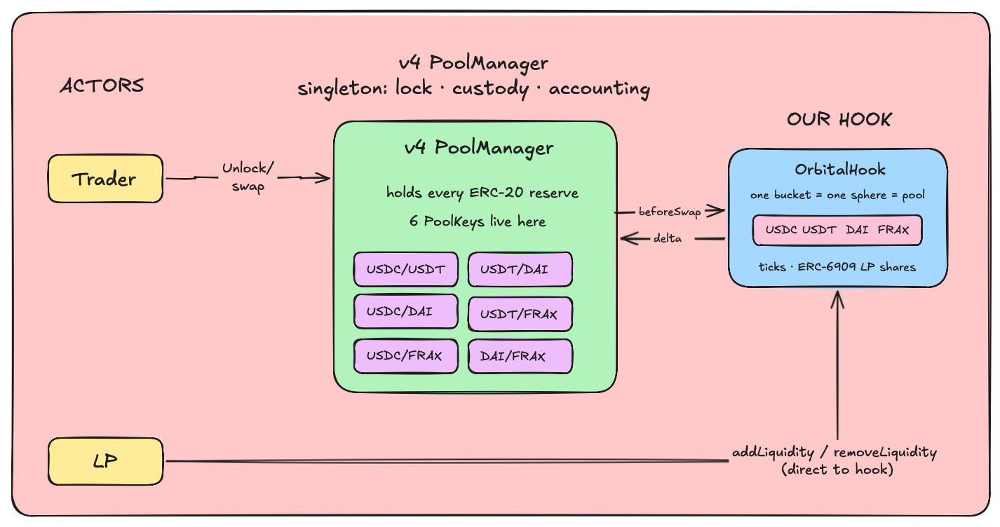
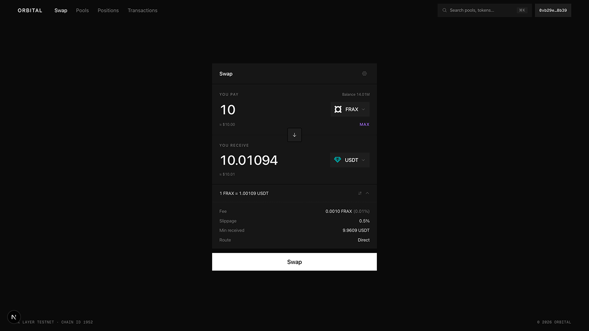
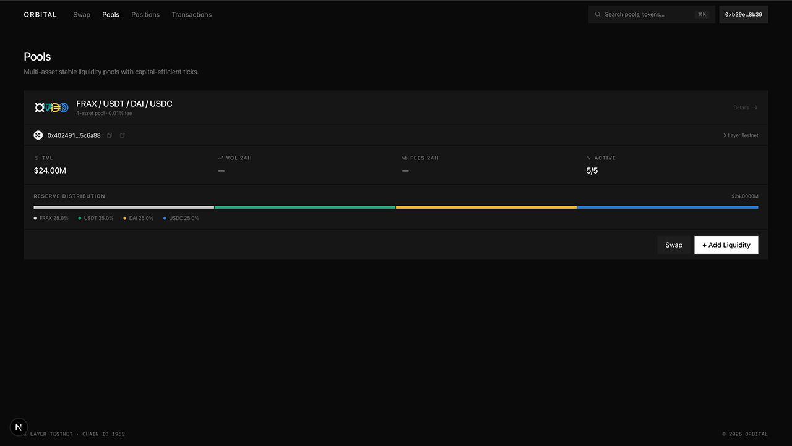
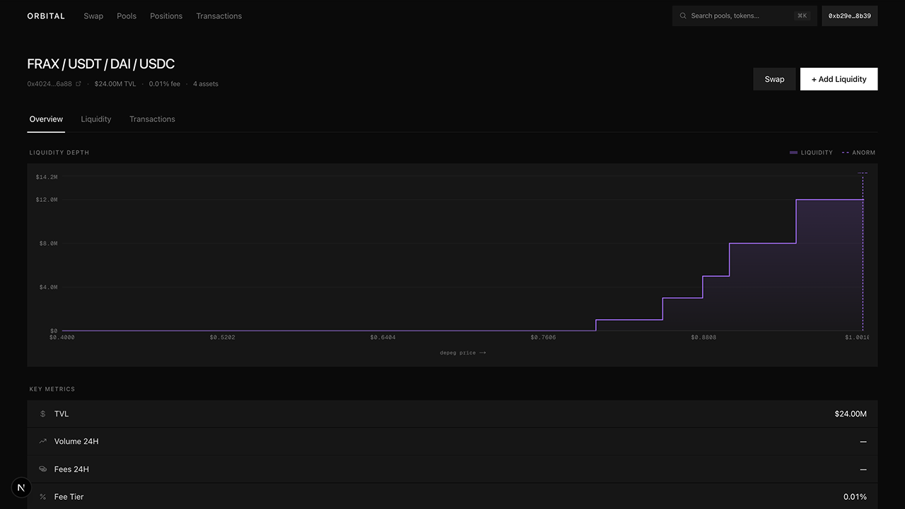
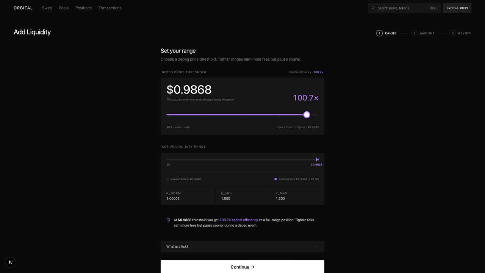
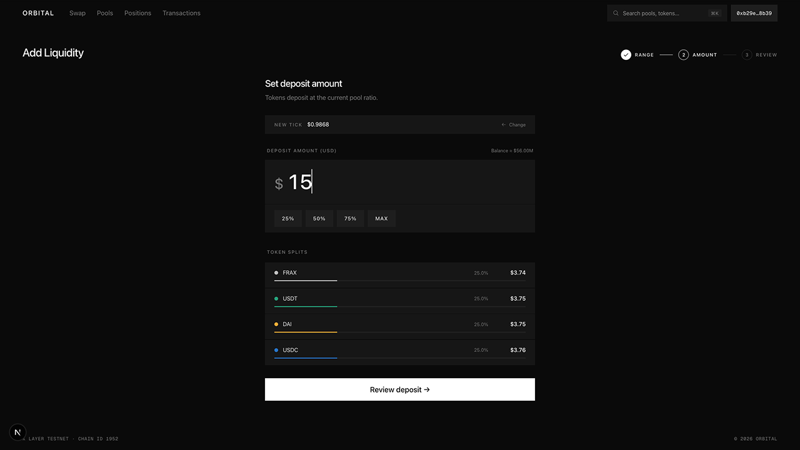
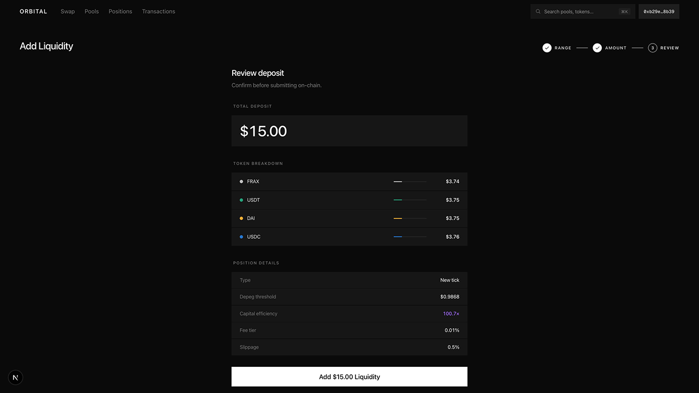
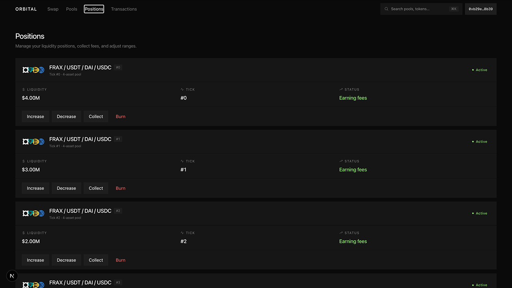

# Orbital Hook

A Uniswap v4 hook that turns a single pool into an N-asset stablecoin AMM. All the stablecoins (USDC, USDT, DAI, FRAX) share one reserve book inside the hook, which swaps them on the Orbital sphere/torus curve instead of Uniswap's constant-product math. The result is concentrated liquidity for a whole basket of dollars, running on top of v4.

> **UHI9 theme: Impermanent Loss & Yield Systems.** Orbital is built to reduce impermanent loss for stablecoin LPs. Liquidity concentrated near the peg keeps IL close to zero while earning more fees per dollar, and if a coin breaks its peg the pool fences it off automatically, capping the tail loss that drains Curve-style stable LPs. A Reactive Network circuit-breaker sits on top as an oracle-driven safety net.

Live app → <https://orbital-hook.vercel.app/> · Unichain Sepolia · Reactive Lasna

---

## The Orbital concept (Paradigm)

Stablecoins all target $1, but AMMs make you choose. Curve holds many stablecoins together yet spreads liquidity flatly across the whole curve. Uniswap v3 concentrates liquidity but only for two tokens. Orbital ([Paradigm, 2025](https://www.paradigm.xyz/2025/06/orbital)) does both at once.

It comes down to the shape of the curve. Uniswap prices two tokens on a hyperbola; Orbital prices N tokens on a sphere:

$$x \cdot y = k \quad \longrightarrow \quad \|\mathbf{r} - \mathbf{x}\|^2 = \sum_{i=1}^{n}(r - x_i)^2 = r^2$$

- **Sphere.** The reserve vector $\mathbf{x} = (x_1, \dots, x_n)$ is a point on an N-sphere of radius $r$ centred at $\mathbf{r} = (r, \dots, r)$. The peg is the equal-price point $x_i = r\left(1 - \tfrac{1}{\sqrt{n}}\right)$, where every coin trades exactly 1:1. The curve only starts to bend as the basket drifts off peg.
- **Ticks.** Each LP picks a plane $\sum_i x_i = k$ that cuts the sphere at a depeg bound, for example "provide liquidity only while the price holds above \$0.95". This is the concentration: capital sits in the narrow band near peg where stablecoins actually trade, rather than being spread across prices that never happen.
- **Torus.** Stacked ticks fold into a single torus that the pool tracks with two running sums, $\sum x_i$ and $\sum x_i^2$. A swap stays O(1) however many coins or ticks exist.

That combination is the whole point, and it lines up directly with the hackathon theme: **less impermanent loss for stablecoin LPs.** Many stablecoins sit in one capital-efficient pool, and depeg isolation handles the tail risk. When one coin breaks peg its tick exits to the boundary and the rest keep trading 1:1, so a single broken coin can't drain the LPs who supplied the others.

---

## What we built

We ported the full Orbital math from the paper (the N-sphere invariant, the per-tick depeg planes, the torus consolidation, and the quartic tick-crossing solver) and run it inside a v4 hook. On every swap, `beforeSwap` evaluates that engine and hands back the trade, so any pair prices on the Orbital curve instead of constant-product. v4 still does the custody, settlement, and accounting.

There is one catch: a v4 pool is always exactly two tokens. To fit four stablecoins into a single book, we register the $\binom{4}{2} = 6$ pairs as six separate v4 pools and point every `PoolKey.hooks` at the same hook. Those pairs are only views; behind all of them the hook keeps one shared reserve vector. A trade on USDC/USDT and a trade on DAI/FRAX move the same reserves and the same price.

---

## Architecture

The six pairs are `PoolKey`s that live inside the one PoolManager, and every key's `hooks` field points at the same contract, [`OrbitalHook.sol`](orbitalHook/src/OrbitalHook.sol). The PoolManager holds all the tokens and the lock; the hook holds the curve and the shared reserves.



**Three actors:**

- **PoolManager** is the v4 singleton. It owns the lock, custody of every real ERC-20, and the deferred-delta ("flash") accounting. The six `PoolKey`s are entries in this one contract, not separate deployments.
- **OrbitalHook** is our code. It holds the abstract state: the reserve vector $\mathbf{x}$ (the sphere), the ticks, the accrued fees, and the ERC-6909 LP shares it issues. It provides the curve and the LP entry points, but it never custodies real tokens.
- **Trader and LP.** A trader reaches the pool through any v4 router (`unlock`, then `swap`). An LP calls the hook directly (`addLiquidity`, `removeLiquidity`, `collect`), and the hook runs the `unlock` on their behalf.

### Token custody: flash accounting and two claim ledgers

This is the part that's easy to get wrong, so it's worth being precise. There are two separate ERC-6909 ledgers, and they mean different things.

1. **PoolManager claim tokens, held by the hook.** Real ERC-20s always sit in the PoolManager. When value flows into the pool, the hook turns its positive balance-delta into PoolManager *claim tokens* (`poolManager.mint(address(this), …)`), a redeemable IOU against the singleton's custody. So the hook's "ownership" of the pooled liquidity is just a claim-token balance; it never holds raw ERC-20. To pay value out it burns those claim tokens (`settle(..., claims=true)`) and the PoolManager releases the underlying to the recipient (`take(..., claims=false)`).
2. **OrbitalHook LP shares, held by the LP.** The hook is also an ERC-6909 in its own right, with `tokenId = tickIdx`. Adding liquidity mints you a share of your tick (`_mint(you, tickIdx, rWad)`). These shares are soulbound in v1 (`transfer` and `transferFrom` revert) and are how the hook tracks who owns what, along with per-position fee checkpoints.

All of this happens inside a single `unlock` frame. The PoolManager hands control to the callback, balances move only as deltas in transient storage, and `unlock` refuses to return until every currency delta nets to zero. No tokens move until the books balance.

### LP path: `addLiquidity`

```
LP ─► hook.addLiquidity(k, r, maxAmounts)         (LP calls the hook, not the PoolManager)
        └─ poolManager.unlock(MINT, …)
             └─ unlockCallback (only callable by PoolManager):
                  • compute equal-price deposit amounts for radius r
                  • update reserves / sumX / sumXSq / rInt  (the torus)
                  • for each asset:
                       settle()  ← pull the LP's ERC-20 into the PoolManager
                       mint()    → convert the +delta into claim tokens held by the hook
                  • check the sphere invariant (revert if broken)
                  • _mint(LP, tickIdx, rWad)   → issue the ERC-6909 LP share
        unlock returns only once every delta == 0
```

`removeLiquidity` and `collect` run the same flow in reverse. `take(..., claims=false)` sends real ERC-20 out of the PoolManager to the LP, the hook burns the matching claim tokens with `settle(..., claims=true)`, and the LP's shares are burned (for `collect`, only the accrued fees are paid). Pausing the pool never blocks either path, so LPs can always exit.

---

## Runtime: one swap

A trader never calls `swap` directly. A router calls `unlock`, the PoolManager calls back, and the swap plus settlement happen inside that locked frame. No tokens move until the deltas net to zero.

```
caller.unlock(data)
└─ PoolManager unlocks, calls back ────────────────┐
   unlockCallback(data):                           │  runs inside the lock
     swap(poolKey, params)                         │
       ├─ beforeSwap → Orbital BeforeSwapDelta      │  (default x·y math bypassed)
       └─ records currency deltas (no tokens move) │
     settle()  ← trader pays input  (hook takes it as claim tokens)
     take()    ← trader pulls output (hook burns claim tokens to cover it)
└─ unlock returns ─────────────────────────────────┘
   PoolManager asserts every delta == 0  (else revert)
```

Inside `beforeSwap` the hook runs the Orbital engine and returns a `BeforeSwapDelta` that fully specifies the trade, so the PoolManager's default `x·y` math is bypassed. It takes the trader's input as claim tokens and burns claim tokens to release the output. Two invariants hold the whole time: `swap` moves no tokens (it only writes deltas to transient storage), and `unlock` won't return until every currency delta is zero.

---

## Why it matters

- **No liquidity fragmentation.** Four stablecoins would normally need six separate pools, each with its own shallow depth. Here the six pairs share one book, so a USDC/FRAX trade draws on the same liquidity as USDC/USDT. One deep pool instead of six thin ones.
- **Capital efficiency from virtual reserves.** A tick removes the curve below its depeg bound, so a small amount of real capital behaves like a much larger reserve near peg. It is Uniswap v3's virtual liquidity, generalized to the N-sphere.
- **N coins, not 2.** A single pool prices a whole basket of dollars off one sphere, so you can add another stablecoin without standing up a new market.
- **Depeg isolation contains impermanent loss.** When a coin breaks peg, its tick exits to the boundary and the rest keep trading 1:1, so the broken coin doesn't drain the pool. This is exactly the tail IL that wrecks flat stable LPs, where a depeg dumps the whole pool into the broken coin. Orbital caps it by construction.
- **Automatic circuit-breaker.** A Reactive Network watcher pauses the pool the moment an external oracle reports a depeg, before the on-pool price has even caught up (details below).
- **Built on v4, not beside it.** The hook only supplies the curve; custody, accounting, and the unlock/settle flow are all v4's, so the pools are reachable by any v4 router or aggregator.

---

## Depeg circuit-breaker (Reactive Network)

The pool already isolates a depegged coin through its geometry, but it only notices a depeg once trades have pushed its internal price there, which is exactly when LPs are losing value. To close that gap we added an external, oracle-driven safety net built on **[Reactive Network](https://reactive.network/)**.

```
 Origin chain                 Reactive Lasna                 Unichain Sepolia (1301)
 Chainlink feed   ──log──▶   OrbitalDepegReactive  ──callback──▶  OrbitalDepegCallback
 AnswerUpdated              price out of peg band?               └─▶ hook.guardianPause()
```

1. **`OrbitalDepegReactive`**, deployed on Reactive Lasna, subscribes to a Chainlink feed's `AnswerUpdated` event for one of the pool's stablecoins. When the price leaves the peg band it emits a cross-chain `Callback`.
2. The Reactive callback proxy on Unichain Sepolia invokes **`OrbitalDepegCallback`**, which is registered as the hook's `guardian` and calls `OrbitalHook.guardianPause()`.
3. The pool pauses, faster than any human or keeper could react. The breaker can only pause, which is the fail-safe direction; `unpause()` stays owner-only, so a person reviews the situation before liquidity resumes.

`reactive-lib` stays out of the audited core. The only change to the hook is a `guardian` role. The breaker contracts and a two-step deploy script live in [`orbitalHook/src/reactive/`](orbitalHook/src/reactive/README.md).

**Reactive infrastructure (testnet).** A testnet origin and destination must pair with the Reactive Lasna testnet; mainnets and testnets can't be mixed.

| Role | Chain | Address |
|---|---|---|
| [`OrbitalDepegReactive`](orbitalHook/src/reactive/OrbitalDepegReactive.sol) (watcher → emits `Callback`) | Reactive Lasna (5318007) | `0xa854E3ee9eFa1936034dE51CCD6e6fB66F4309cF` |
| [`OrbitalDepegCallback`](orbitalHook/src/reactive/OrbitalDepegCallback.sol) (destination receiver → `guardianPause`, hook `guardian`) | Unichain Sepolia (1301) | `0x7f5A05f555ee3F270d63ACa998CDBa421E458A73` |
| [`MockChainlinkFeed`](orbitalHook/src/reactive/MockChainlinkFeed.sol) (triggerable demo feed) | Unichain Sepolia (1301) | `0x959dfEAb43690fB0037B9a8E5746Df942A1C3A81` |
| Destination callback proxy | Unichain Sepolia (1301) | `0x9299472A6399Fd1027ebF067571Eb3e3D7837FC4` |
| Reactive system contract | Reactive Lasna (5318007) | `0x0000000000000000000000000000000000fffFfF` |

Reactive Lasna RPC is `https://lasna-rpc.rnk.dev/`. Both breaker contracts ship in the repo and deploy with the steps in [`orbitalHook/src/reactive/DEPLOY.md`](orbitalHook/src/reactive/DEPLOY.md). The addresses above are the live testnet deployment; in the demo the watcher subscribes to the mock feed on Unichain Sepolia (a valid Reactive origin) and pauses the hook on the same chain when the price leaves the peg band.

---

## How it compares

| Property | Uniswap V3 | Curve Stable | Balancer | Orbital |
|---|---|---|---|---|
| Assets per pool | 2 | 2–8 (fixed) | 2–8 (fixed) | N (≥ 2) |
| Concentrated liquidity | Yes | No | No | Yes |
| Per-LP depeg range | n/a | No | No | Yes |
| Depeg drains pool | n/a | Yes | Yes | Isolated |
| Capital efficiency at peg | High (pair) | ~1–2× flat | ~1–2× flat | ~154× flat, N=5 |
| TWAP oracle | Yes | No | Yes | Roadmap |
| LP position type | NFT (721) | LP token | LP token | ERC-6909 |
| Venue | Standalone | Standalone | Standalone | Uniswap v4 hook |

---

## Walkthrough

<table>
<tr>
<td width="50%" valign="middle">

**Swap**

Trade any two of the four stablecoins from one shared pool at close to 1:1. Every pair routes through the same liquidity, and if one coin depegs the rest keep trading while the bad leg is fenced off.

</td>
<td width="50%"></td>
</tr>

<tr>
<td width="50%" valign="middle">

**Pools**

All four stablecoins live in a single shared book. Every pair is a view onto the same reserves, so liquidity never fragments and depth compounds across the whole basket.

</td>
<td width="50%"></td>
</tr>

<tr>
<td width="50%" valign="middle">

**Liquidity depth**

Depth concentrates against the $1 peg where stablecoins actually trade, instead of spreading flat across prices that never happen. That concentration is where the capital efficiency comes from.

</td>
<td width="50%"></td>
</tr>

<tr>
<td width="50%" valign="middle">

**Add liquidity: range**

Pick a depeg threshold and your capital concentrates above it. A tighter range earns more fees but pauses sooner if a coin depegs; a wider range is a safer backstop. Every LP sets their own.

</td>
<td width="50%"></td>
</tr>

<tr>
<td width="50%" valign="middle">

**Add liquidity: amount**

Your deposit splits across all four tokens at the current pool ratio, so you take balanced exposure to the whole basket in one step, with no rebalancing across pairs.

</td>
<td width="50%"></td>
</tr>

<tr>
<td width="50%" valign="middle">

**Add liquidity: review**

Check the full breakdown (tokens, depeg threshold, fee tier, slippage) and confirm. It settles on-chain in one transaction as an ERC-6909 position the hook issues against your tick.

</td>
<td width="50%"></td>
</tr>

<tr>
<td width="50%" valign="middle">

**Positions**

Manage everything in one place. Each tick you hold is its own ERC-6909 share that earns fees independently, and you can increase, decrease, collect, or burn it anytime.

</td>
<td width="50%"></td>
</tr>
</table>

---

## Repo layout

```
UHI/
├── orbitalHook/        Solidity: the v4 hook + Reactive depeg breaker (see orbitalHook/README.md)
│   └── src/reactive/   Reactive Network circuit-breaker contracts
└── frontend/           Next.js app: swap, pools, positions, sim (see frontend/README.md)
```

---

## Deployed on Unichain Sepolia (chainId 1301)

Uniswap v4 is canonically deployed on Unichain, so the hook plugs into the official `PoolManager`, `SwapRouter`, and `V4Quoter` rather than a self-hosted stack.

| Contract | Address |
|---|---|
| [OrbitalHook](orbitalHook/src/OrbitalHook.sol) (guardian-enabled) | `0x7FA9c378ee27156E3De1F7d9006e99e3734f2a88` |
| PoolManager (v4, canonical) | `0x00B036B58a818B1BC34d502D3fE730Db729e62AC` |
| V4Quoter (canonical) | `0x56DCD40A3F2d466F48e7F48bDBE5Cc9B92Ae4472` |
| SwapRouter (v4) | `0xb974DE781ec4bCf09d91Db13A3aF74d14FfE7540` |
| Permit2 (canonical) | `0x000000000022D473030F116dDEE9F6B43aC78BA3` |
| USDC (mock) | `0xb121A64E48777A85E5C523952a45d438B54D83dD` |
| USDT (mock) | `0x5205921cb07fd21abBBDa07009bfB20A3291cA0B` |
| DAI (mock) | `0x056eF6D92777a2640023A3c49da34BE63E178159` |
| FRAX (mock) | `0x14789E93563b4Db8367Efc248Ed064e421Cd80f6` |
| Admin / owner | `0xb29e1ddDfc73E00dEE3EaA7EA102990ADca78b39` |

This is the guardian-enabled deployment used with the Reactive breaker (its `guardian` is the `OrbitalDepegCallback` above). The pool is seeded with mock-token liquidity across four interior ticks at depeg bounds 0.95 / 0.90 / 0.85 / 0.80.

- Live app: <https://orbital-hook.vercel.app/>
- Hook explorer: <https://sepolia.uniscan.xyz/address/0x7FA9c378ee27156E3De1F7d9006e99e3734f2a88>

---

## Getting started

```bash
# Contracts
cd orbitalHook
forge test                       # 121 passing

# Frontend
cd frontend
npm install && npm run dev       # http://localhost:3000
```

Foundry uses `via_ir = true` (required by the Orbital math libraries). Clone with `--recurse-submodules`, or run `git submodule update --init --recursive` afterwards.

---

## References

- Paradigm Orbital paper: <https://www.paradigm.xyz/2025/06/orbital>
- Uniswap v4 docs: <https://docs.uniswap.org/contracts/v4/overview>
- Reactive Network docs: <https://dev.reactive.network/>
- Our standalone Orbital AMM that shares the same engine: [`../contracts`](../contracts) (parent project)
