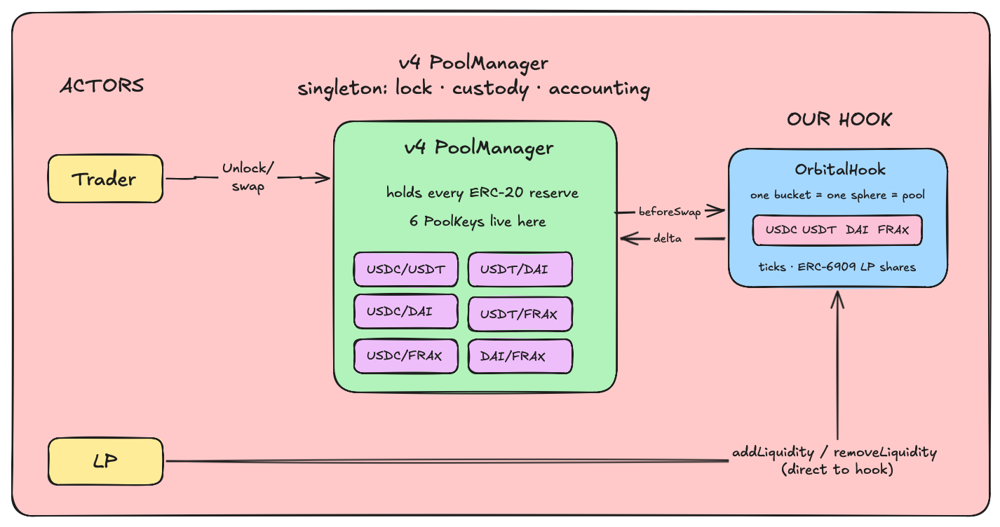
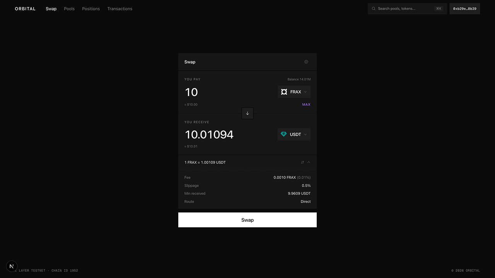
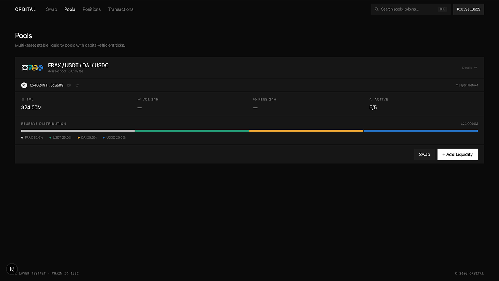
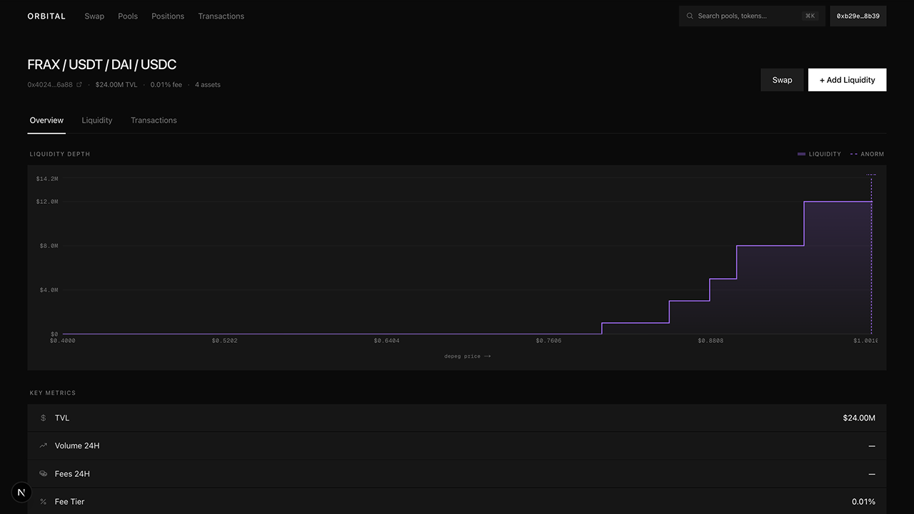
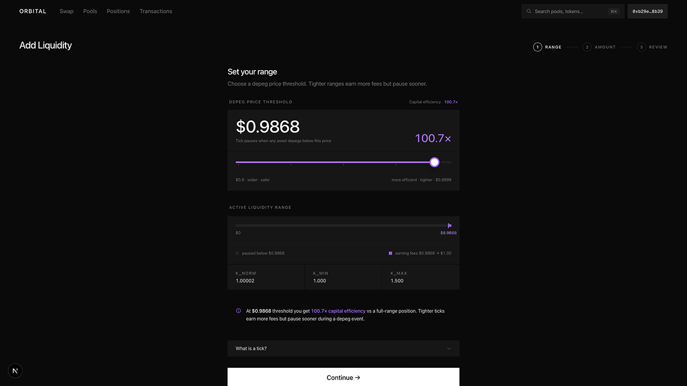
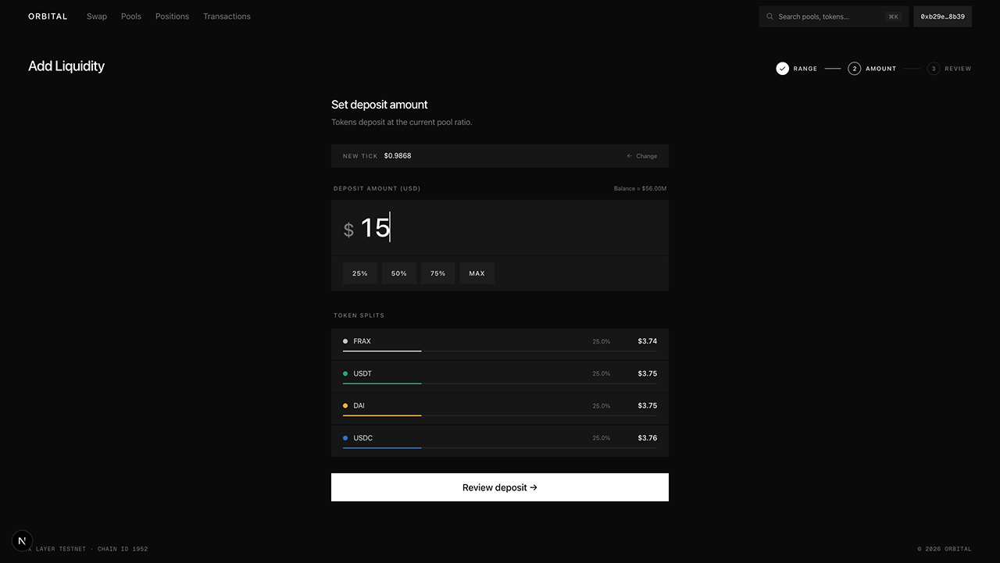
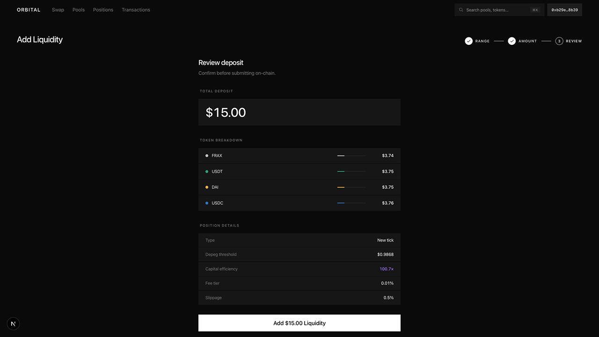
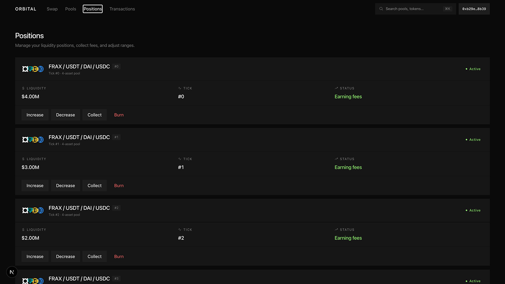

# Orbital Hook

**One pool for every stablecoin.** A Uniswap v4 hook that replaces constant-product math with the Orbital sphere/torus curve, so USDC, USDT, DAI and FRAX all trade out of a single shared reserve book instead of six shallow pairs.

<p>
<a href="https://orbital-hook.vercel.app/"><b>Live app</b></a> &nbsp;·&nbsp;
Arbitrum &nbsp;·&nbsp; Unichain &nbsp;·&nbsp; Robinhood Chain &nbsp;·&nbsp;
<b>179 tests</b> &nbsp;·&nbsp;
<b>3 live pools, ~$15M TVL</b> &nbsp;·&nbsp;
<b>N assets, one book</b>
</p>

---

## The Orbital concept

Stablecoins all target $1, but AMMs make you choose. Curve holds many stablecoins together yet lays liquidity flatly along the whole curve. Uniswap v3 concentrates properly and then caps you at two tokens. Orbital ([Paradigm, 2025](https://www.paradigm.xyz/2025/06/orbital)) does both at once.

It comes down to the shape of the curve. Uniswap prices two tokens on a hyperbola; Orbital prices N tokens on a sphere:

$$x \cdot y = k \quad \longrightarrow \quad \|\mathbf{r} - \mathbf{x}\|^2 = \sum_{i=1}^{n}(r - x_i)^2 = r^2$$

| | |
|---|---|
| **Sphere** | The reserve vector $\mathbf{x} = (x_1, \dots, x_n)$ is a point on an N-sphere of radius $r$ centred at $\mathbf{r} = (r, \dots, r)$. The peg is the equal-price point $x_i = r(1 - 1/\sqrt{n})$, where every coin trades exactly 1:1. The curve only bends as the basket drifts off peg. |
| **Ticks** | Each LP picks a plane $\sum_i x_i = k$ cutting the sphere at a depeg bound, for example "provide liquidity only while the price holds above \$0.95". That is the concentration: capital sits where stablecoins actually trade. |
| **Torus** | Stacked ticks fold into a single torus the pool tracks with two running sums, $\sum x_i$ and $\sum x_i^2$. A swap stays O(1) however many coins or ticks exist. |

---

## What it gives you

<table>
<tr>
<td width="33%" valign="top">

### No fragmentation

Four stablecoins normally need **six separate pools**, each with its own shallow depth. Orbital keeps **one book**: a USDC/FRAX trade draws on exactly the same liquidity as USDC/USDT.

Adding a fifth coin adds a dimension, not a market.

</td>
<td width="33%" valign="top">

### Low slippage

Liquidity concentrates in the narrow band around $1 where dollars actually change hands, not spread across prices that never occur.

**1.07 bps** all-in on a $1k swap and **7.9 bps** on $100k, fee included, measured on a live $5M pool.

</td>
<td width="33%" valign="top">

### Deep liquidity

Depth compounds across the whole basket instead of splitting between pairs, and virtual reserves multiply what each real dollar does.

Up to **~154x** the effective depth of a flat pool at N=5, per the Orbital paper.

</td>
</tr>
<tr>
<td valign="top">

### Depeg isolation

Each LP sets the depeg they will hold. Cross it and that tick exits to the boundary and stops quoting, so a broken coin cannot drain the LPs who supplied the healthy ones.

This is the tail loss that wrecks flat stable pools.

</td>
<td valign="top">

### Real stablecoins

USDC and USDT are 6-decimal, DAI and FRAX are 18. The engine runs in WAD and converts only at the token boundary, rounding in the pool's favour every time.

Checked by a 128k-call solvency fuzz on a mixed-decimal pool.

</td>
<td valign="top">

### Travels well

Because one book holds every asset, any stablecoin is a single hop from any other. That makes the pool unusually cheap to fill against, which the ERC-7683 layer below builds on.

An extension, not the core.

</td>
</tr>
</table>

---

## What we built

We ported the full Orbital math from the paper (the N-sphere invariant, per-tick depeg planes, torus consolidation, and the quartic tick-crossing solver) and run it inside a v4 hook. On every swap `beforeSwap` evaluates that engine and hands back the trade, so any pair prices on the Orbital curve instead of constant-product. v4 still does custody, settlement and accounting.

A v4 pool is always exactly two tokens, so to fit four stablecoins into a single book we register the $\binom{4}{2} = 6$ pairs as six v4 pools and point every `PoolKey.hooks` at the same hook. Those pairs are only views. Behind all of them the hook keeps **one** shared reserve vector, so a trade on USDC/USDT and a trade on DAI/FRAX move the same reserves and the same price.

---

## Architecture

Six pairs are `PoolKey`s inside the one PoolManager, and every key's `hooks` field points at the same contract, [`OrbitalHook.sol`](orbitalHook/src/OrbitalHook.sol). The PoolManager holds the tokens and the lock; the hook holds the curve and the shared reserves.



- **PoolManager** is the v4 singleton. It owns the lock, custody of every real ERC-20, and the deferred-delta ("flash") accounting. The six `PoolKey`s are entries in this one contract, not separate deployments.
- **OrbitalHook** is our code. It holds the abstract state: the reserve vector $\mathbf{x}$, the ticks, accrued fees, and the ERC-6909 LP shares it issues. It supplies the curve but never custodies real tokens.
- **Trader and LP.** A trader reaches the pool through any v4 router. An LP calls the hook directly (`addLiquidity`, `removeLiquidity`, `collect`) and the hook runs the `unlock` on their behalf.

### Token custody: two claim ledgers

This is the part that is easy to get wrong, so it is worth being precise. There are two separate ERC-6909 ledgers and they mean different things.

1. **PoolManager claim tokens, held by the hook.** Real ERC-20s always sit in the PoolManager. When value flows in, the hook turns its positive balance-delta into PoolManager claim tokens (`poolManager.mint(address(this), ...)`), a redeemable IOU against the singleton's custody. To pay out it burns them and the PoolManager releases the underlying.
2. **OrbitalHook LP shares, held by the LP.** The hook is itself an ERC-6909 with `tokenId = tickIdx`. Adding liquidity mints a share of your tick. These are soulbound in v1 and are how the hook tracks who owns what, alongside per-position fee checkpoints.

All of it happens inside one `unlock` frame. Balances move only as deltas in transient storage, and `unlock` refuses to return until every currency delta nets to zero.

### LP path

```
LP ─► hook.addLiquidity(k, r, maxAmounts)
        └─ poolManager.unlock(MINT, ...)
             └─ unlockCallback (only callable by PoolManager):
                  • compute deposit amounts for radius r
                  • update reserves / sumX / sumXSq / rInt   (the torus)
                  • per asset: settle()  ← pull the LP's ERC-20 in
                               mint()    → convert +delta to claim tokens
                  • verify the balance actually landed  (TokenTransferShortfall)
                  • check the sphere invariant           (revert if broken)
                  • _mint(LP, tickIdx, rWad)             → issue the LP share
        unlock returns only once every delta == 0
```

`removeLiquidity` and `collect` run the same flow in reverse. Pausing never blocks either path, so LPs can always exit.

---

## Runtime: one swap

```
caller.unlock(data)
└─ PoolManager unlocks, calls back ────────────────┐
   unlockCallback(data):                           │  runs inside the lock
     swap(poolKey, params)                         │
       ├─ beforeSwap → Orbital BeforeSwapDelta     │  (default x·y math bypassed)
       └─ records currency deltas (no tokens move) │
     settle()  ← trader pays input
     take()    ← trader pulls output
└─ unlock returns ─────────────────────────────────┘
   PoolManager asserts every delta == 0  (else revert)
```

`beforeSwap` runs the Orbital engine and returns a `BeforeSwapDelta` that fully specifies the trade, so the PoolManager's default `x·y` math never executes. Two invariants hold throughout: `swap` moves no tokens, and `unlock` will not return until every delta is zero.

---

## How it compares

| Property | Uniswap v3 | Curve Stable | Balancer | **Orbital** |
|---|---|---|---|---|
| Assets per pool | 2 | 2 to 8 (fixed) | 2 to 8 (fixed) | **N (≥ 2)** |
| Concentrated liquidity | Yes | No | No | **Yes** |
| Per-LP depeg range | n/a | No | No | **Yes** |
| Depeg drains pool | n/a | Yes | Yes | **Isolated** |
| Capital efficiency at peg | High (pair) | ~1 to 2x flat | ~1 to 2x flat | **~154x flat, N=5** |
| Mixed decimals (6dp + 18dp) | Yes | Yes | Yes | **Yes** |
| Cross-chain settlement | No | No | No | **ERC-7683** |
| LP position type | NFT (721) | LP token | LP token | **ERC-6909** |
| Venue | Standalone | Standalone | Standalone | **Uniswap v4 hook** |

---

## Extension: cross-chain settlement

Everything above is the hook. This part is built on top of it and is not required to use the pool.

The hook is deployed on Arbitrum Sepolia and Unichain Sepolia, peered over Hyperlane, each with an [`OrbitalIntentSettler`](orbitalHook/src/crosschain/OrbitalIntentSettler.sol) implementing [ERC-7683](https://eips.ethereum.org/EIPS/eip-7683), the cross-chain intents standard from Uniswap Labs and Across.

```
 user signs an intent            filler pays out                proof settles
 ──────────────────────          ────────────────               ─────────────
 escrow on origin        ──►     fill on destination     ──►    Hyperlane message
 (ERC-7683 open)                 routed through the             verified by handle(),
                                 local Orbital pool             escrow released
```

Two things make this work well with an N-asset book:

- **A filler needs inventory in only one asset per chain.** Because every stablecoin shares one book, any asset is a single hop from any other. A filler holding just USDC on Arbitrum can satisfy an order for DAI there. That collapses N x M inventory positions to 1 x M.
- **Settlement is cryptographic, not social.** The origin releases escrow only when its Hyperlane Mailbox delivers a message whose `(domain, sender)` matches a registered peer. There is no arbiter, no bond and no dispute game. The trust assumption is exactly Hyperlane's ISM for that route.

Funds are never stuck: if an order is not settled, the user reclaims the escrow after `fillDeadline + refundBuffer`.

---

## Deployments

Three live pools, on Arbitrum Sepolia (primary), Unichain Sepolia and Robinhood Chain testnet. Each chain is a separate book with its own reserves; the ERC-7683 settlers move orders between Arbitrum and Unichain rather than merging liquidity. Robinhood Chain testnet has no Hyperlane, so its pool is same-chain only.

| Chain | Pool | Hook |
|---|---|---|
| **Arbitrum Sepolia** `421614` | USDC · USDT · DAI · FRAX | [`0xdEE6773E69611CfA1395Dc47cDd4Cca6E36CaA88`](https://sepolia.arbiscan.io/address/0xdEE6773E69611CfA1395Dc47cDd4Cca6E36CaA88) |
| Unichain Sepolia `1301` | USDC · USDT · DAI · FRAX | [`0x2ad0767A51fD05c2d150f0f60eE436a52bF76a88`](https://sepolia.uniscan.xyz/address/0x2ad0767A51fD05c2d150f0f60eE436a52bF76a88) |
| Robinhood Chain testnet `46630` | USDC · USDT · DAI · FRAX | [`0x7F063D4852F0BE1Fb39490AcDc3A75ffC398EA88`](https://explorer.testnet.chain.robinhood.com/address/0x7F063D4852F0BE1Fb39490AcDc3A75ffC398EA88) |

| Chain | OrbitalIntentSettler |
|---|---|
| Arbitrum Sepolia | [`0x3104462820D7D721cc7139400016B27cb137D74b`](https://sepolia.arbiscan.io/address/0x3104462820D7D721cc7139400016B27cb137D74b) |
| Unichain Sepolia | [`0x0d20A58a3Ac0D017DFB093dBF3Bd3D843E285784`](https://sepolia.uniscan.xyz/address/0x0d20A58a3Ac0D017DFB093dBF3Bd3D843E285784) |

Each pool uses a realistic decimal mix (USDC/USDT 6dp, DAI/FRAX 18dp) and is seeded with $5M of real capital on a seven-tier ladder: six concentrated bands whose depth tapers away from the peg, plus a small full-range backstop. Random retail swap flow runs on top of that: 96 swaps across the three pools so far, about $73.4k of volume, each trade capped at $5,000. On a $5M stable pool:

| Trade | $1k | $10k | $100k | $250k |
|---|---|---|---|---|
| All-in cost (1 bp fee included) | 1.07 bps | 1.69 bps | 7.9 bps | 21 bps |

Token addresses, v4 infra (PoolManager, router, V4Quoter), Hyperlane Mailboxes and the peer registry all live in [`orbitalHook/deployments.json`](orbitalHook/deployments.json).

> **Asset index order differs per chain.** The hook sorts assets ascending by address, and addresses are unrelated across chains, so USDC is index 3 on Arbitrum, 0 on Unichain and 3 on Robinhood. Always resolve by symbol, never by index.

- Live app: <https://orbital-hook.vercel.app/>
- Subgraphs: [orbital-arbitrum](https://api.studio.thegraph.com/query/107768/orbital-arbitrum/v0.3.0) · [orbital-unichain](https://api.studio.thegraph.com/query/107768/orbital-unichain/v0.3.0)

---

## Repo layout

```
UHI/
├── orbitalHook/            Solidity
│   ├── src/OrbitalHook.sol         the v4 hook and Orbital engine
│   ├── src/libraries/              SphereMath, TorusMath, TickLib, QuadraticSolver
│   ├── src/crosschain/             ERC-7683 settler + Hyperlane interfaces
│   ├── script/                     deploy and simulation scripts
│   │   ├── lib/TierLadder.sol          the liquidity ladder every deploy seeds
│   │   └── ReshapeLiquidity.s.sol      move a live pool onto the ladder in place
│   ├── FEEDBACK.md                 Uniswap v4 developer feedback
│   └── deployments.json            machine-readable address registry
├── subgraph/               The Graph: one manifest, two networks
│   ├── schema.graphql              Pool, Asset, Tick, Swap, TickCross, PoolSnapshot
│   ├── src/mapping.ts              reproduces the engine's own crossing condition
│   └── networks.json               per-chain address + start block
└── frontend/               Next.js app: swap, pools, positions, transactions
    ├── lib/crosschain.ts           pool registry, from deployments.json
    └── lib/subgraph.ts             activity and volume, RPC scanning as fallback
```

---

## Walkthrough

<table>
<tr>
<td width="50%" valign="middle">

**Swap**

Trade any two of the four stablecoins from one shared pool at close to 1:1. Every pair routes through the same liquidity, and picking a token on another chain turns the same widget into a cross-chain order.

</td>
<td width="50%"></td>
</tr>

<tr>
<td width="50%" valign="middle">

**Pools**

All four stablecoins live in a single shared book. Every pair is a view onto the same reserves, so liquidity never fragments and depth compounds across the whole basket.

</td>
<td width="50%"></td>
</tr>

<tr>
<td width="50%" valign="middle">

**Liquidity depth**

Depth concentrates against the $1 peg where stablecoins actually trade, instead of spreading flat across prices that never happen. That concentration is where the capital efficiency comes from.

</td>
<td width="50%"></td>
</tr>

<tr>
<td width="50%" valign="middle">

**Add liquidity: range**

Pick a depeg threshold and your capital concentrates above it. A tighter range earns more fees; a wider range keeps earning through larger moves. Every LP sets their own.

</td>
<td width="50%"></td>
</tr>

<tr>
<td width="50%" valign="middle">

**Add liquidity: amount**

Your deposit splits across all four tokens at the current pool ratio, so you take balanced exposure to the whole basket in one step, with no rebalancing across pairs.

</td>
<td width="50%"></td>
</tr>

<tr>
<td width="50%" valign="middle">

**Add liquidity: review**

Check the full breakdown (tokens, depeg threshold, fee tier, slippage) and confirm. It settles on-chain in one transaction as an ERC-6909 position the hook issues against your tick.

</td>
<td width="50%"></td>
</tr>

<tr>
<td width="50%" valign="middle">

**Positions**

Manage everything in one place. Each tick you hold is its own ERC-6909 share that earns fees independently, and you can increase, decrease, collect, or burn it anytime.

</td>
<td width="50%"></td>
</tr>
</table>

---

## Testing

**179 tests across 14 suites.** The ones that carry the weight:

| Suite | What it proves |
|---|---|
| `Solvency.invariant.t.sol` | Stateful fuzz, **256 runs / 128k calls**, on two decimal profiles. Real claim-token custody always covers reserves plus accrued fees, and rounding only ever favours the pool. The mixed-decimal profile (6/6/18) is the one that actually exercises the scaling layer; an all-18 run leaves every conversion a no-op and proves nothing about it. |
| `MixedDecimalsLifecycle.t.sol` | Deterministic add → swap → collect → partial burn → full burn on a 6dp book, so every operation is asserted to *succeed*, not merely to not break. Also asserts a fee-on-transfer token is refused at the deposit boundary. |
| `OrbitalHook.t.sol` | 61 tests over the hook surface: constructor guards, hook permissions, LP entry, swaps, tick crossings, boundary behaviour, pause and ownership. |
| `VirtualLiquidity.t.sol` · `SolverRobustness.t.sol` | Concentrated deposits and withdrawals, depth per unit of capital, and swaps up to the edge of the book without breaking the solver. |
| Math libraries | `SphereMath`, `TorusMath`, `TickLib`, `QuadraticSolver`, including fuzzed solver residual and stability bounds. |

The cross-chain extension adds `OrbitalIntentSettler.t.sol` and `CrosschainFork.t.sol`, the latter running live forks of two testnets at once against real Hyperlane Mailboxes, with a forged-proof test asserting escrow does not move for a wrong `(domain, sender)`.

```bash
cd orbitalHook && forge test          # 179 tests
```

---

## Indexing and monitoring

Both deployments are indexed by [`subgraph/`](subgraph), which the app reads for
its activity feed and 24h volume.

The point is not a dashboard. `TickCrossed` only fires *after* a depeg bound is hit,
so as a warning it arrives too late. Every handler therefore also reads live `slot0`
and `ticks` at its own block and reproduces the engine's crossing condition,

```
alphaNorm = ((sumX·WAD/√N) − kBound)·WAD / rInt      kNorm = k·WAD / r
```

storing how much slack each tick has left. That turns the feed into a leading
indicator: it shows which tick will cross first and how much of the book leaves
with it, before it happens.

---

## Getting started

```bash
git clone --recurse-submodules <repo>

cd orbitalHook
forge test                       # 179 tests

cd ../frontend
cp .env.example .env.local       # optional: dedicated RPC URLs
npm install && npm run dev       # http://localhost:3000
```

Foundry uses `via_ir = true`, required by the Orbital math libraries. If you cloned without submodules, run `git submodule update --init --recursive`.

---

## References

- Paradigm Orbital paper: <https://www.paradigm.xyz/2025/06/orbital>
- ERC-7683 cross-chain intents: <https://eips.ethereum.org/EIPS/eip-7683>
- Uniswap v4 docs: <https://docs.uniswap.org/contracts/v4/overview>
- Hyperlane docs: <https://docs.hyperlane.xyz>
